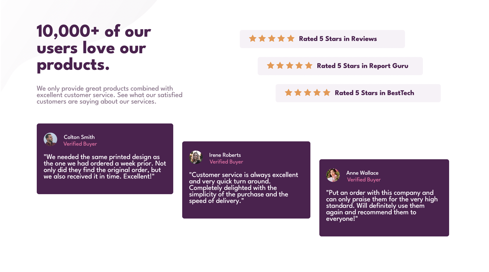
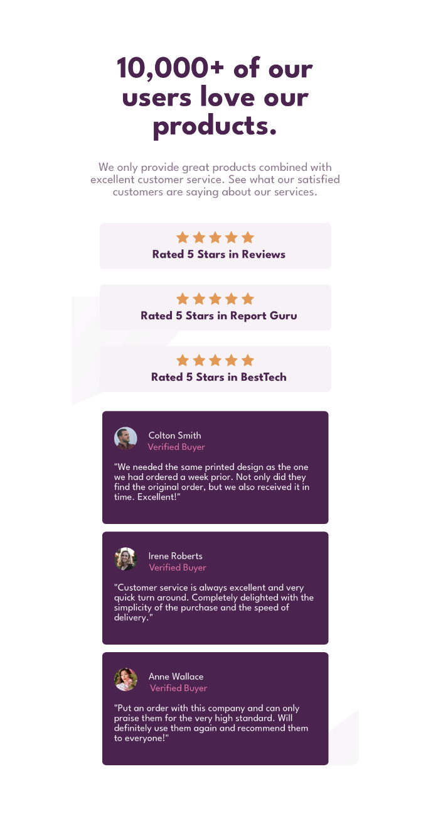

# Frontend Mentor - Social proof section solution

This is a solution to the [Social proof section challenge on Frontend Mentor](https://www.frontendmentor.io/challenges/social-proof-section-6e0qTv_bA). Frontend Mentor challenges help you improve your coding skills by building realistic projects. 

## Table of contents

- [Overview](#overview)
  - [The challenge](#the-challenge)
  - [Screenshot](#screenshot)
  - [Links](#links)
- [My process](#my-process)
  - [Built with](#built-with)
  - [Useful resources](#useful-resources)
- [Author](#author)

## Overview

### The challenge

Users should be able to:

- View the optimal layout for the section depending on their device's screen size

### Screenshot

### Links

- Solution URL: [Solution](https://github.com/TheDeola/social-proof-section-master)
- Live Site URL: [Live Site](https://social-section-proof.netlify.app/)

## My process

### Built with

- Semantic HTML5 markup
- CSS custom properties
- Flexbox
- CSS Grid
- Mobile-first workflow

### Useful resources

- [MDN](https://developer.mozilla.org/) 
- [W3schools](https://www.w3schools.com/)

## Author

- Website - [TheDeola](https://www.your-site.com)
- Frontend Mentor - [@TheDeola](https://www.frontendmentor.io/profile/TheDeola)
- Twitter - [@deolacodes](https://www.twitter.com/deolacodes)

